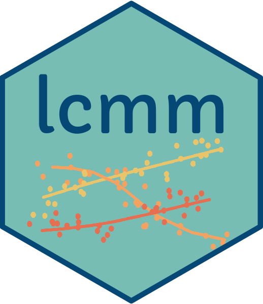

#  lcmm


## Installation


To install the CRAN version, use :

``` r
install.packages("lcmm")
```

To get the most recent update, install it from github :

``` r
remotes::install_github("CecileProust-Lima/lcmm")
```


## Documentation


The complete documentation is available on the lcmm website <https://CecileProust-Lima.github.io/lcmm/>, along with vignettes for each of the main estimating function of the package.

A detailed companion paper is also available in Journal of Statistical
Software :

Proust-Lima C, Philipps V, Liquet B. Estimation of Extended Mixed Models
Using Latent Classes and Latent Processes: The R Package lcmm. Journal
of Statistical Software, Articles. 2017;78(2):1-56.
<https://doi.org/10.18637/jss.v078.i02>

And specific statistical models estimated are described in various
statistical papers of the authors.


## Issues


Issues and questions about the use of the lcmm package are reported on the github issue page <https://github.com/CecileProust-Lima/lcmm/issues>.
Please check both opened and closed issues to make sure that the topic has not already been treated before creating a new issue. To report a bug, please provide a reproducible example.

